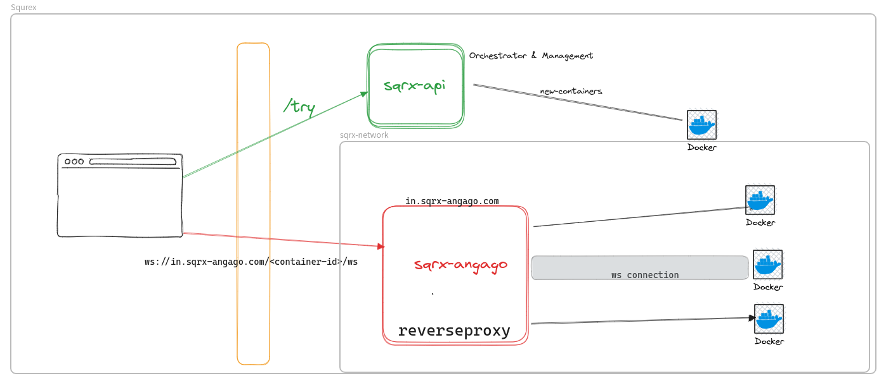

# squarex

Container Isolations- Websocket reverse proxy - Remote Browser Isolations

---



---

> Demo video

### How to run

```bash
./run.sh
```

### Remote Browser Isolation

- Pixel pushing/streaming
- Page scrubbing

### limitations

- max 65536 socket connections per server
- each socket connection last for min 3 min to max 10 mins
  - in 1 hour, 6\*65536 = 3,93,216 connections
  - in 24 hours, (6*24)*65536 = 94,60,224 connections

```
# create network for sqrx
docker network create sqrx-network
```

## sqrx-api-server

- /try endpoint to spin up a new container
- /status endpoint to check status of a container (running or not)
- /stop endpoint to stop a container
